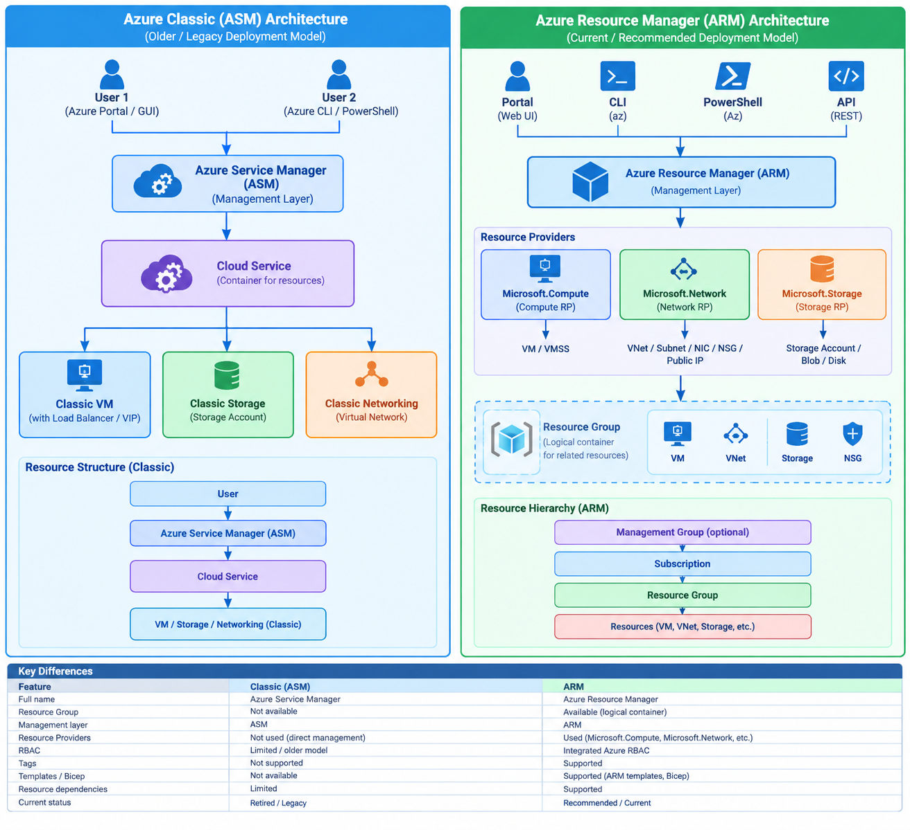

## 1. Current ARM Architecture Overview

Every single action in Azure — whether from the Portal, CLI, PowerShell, SDKs, or Terraform — flows through **one unified API layer: Azure Resource Manager (ARM)**. This is what makes Azure's management experience *consistent* no matter which tool you pick.

### Request Flow (Step-by-Step)
```
1. You send a request
   (Portal click / az command / PowerShell cmdlet / REST call / Template)
                        │
                        ▼
2. Authentication (Microsoft Entra ID)
   → Confirms WHO you are
                        │
                        ▼
3. Authorization (Azure RBAC)
   → Confirms WHAT you're allowed to do
                        │
                        ▼
4. ARM validates the request
   → Checks syntax, resource provider, API version, policies
                        │
                        ▼
5. Request routed to the correct Resource Provider
   → e.g., Microsoft.Compute, Microsoft.Storage, Microsoft.Network
                        │
                        ▼
6. Resource Provider executes the action
   → Resource is created / updated / deleted
                        │
                        ▼
7. ARM returns the result + logs it to Activity Log
```


## Resource manager 
- Azure Resource Manager is the deployment and management service for Azure.
- which manages all the resources created in Azure cloud

## resource group - A container that holds related resources for an Azure solution. The resource group includes those resources that you want to manage as a group.

## Classic vs ARM 


## Understanding ARM template 
- **JSON** syntax files to create an manage Azure resources
- uses Declarative syntax
- focuses on what you want to create


## Benefits of ARM template 
- IAC : scripts 
- idempotent deployments : repetitive task can be skip and all the resources created silmilar 
- Orchestrated Deployment : manage infrastructure 
- build in validation : redeployment checks

### 🧪 Practice Lab
1. In Cloud Shell (Bash), create two resource groups:
   ```bash
   az group create --name rg-scope-lab-1 --location eastus
   az group create --name rg-scope-lab-2 --location westus
   ```
2. Create a storage account in `rg-scope-lab-1`:
   ```bash
   az storage account create --name scopelabstorage123 --resource-group rg-scope-lab-1 --location eastus --sku Standard_LRS
   ```
3. **Move** it to `rg-scope-lab-2`:
   ```bash
   az resource move --destination-group rg-scope-lab-2 \
     --ids $(az storage account show --name scopelabstorage123 --resource-group rg-scope-lab-1 --query id -o tsv)
   ```
4. Confirm it now lives in `rg-scope-lab-2`:
   ```bash
   az resource list --resource-group rg-scope-lab-2 --output table
   ```
5. Clean up: `az group delete --name rg-scope-lab-1 --yes` and `az group delete --name rg-scope-lab-2 --yes`

---
