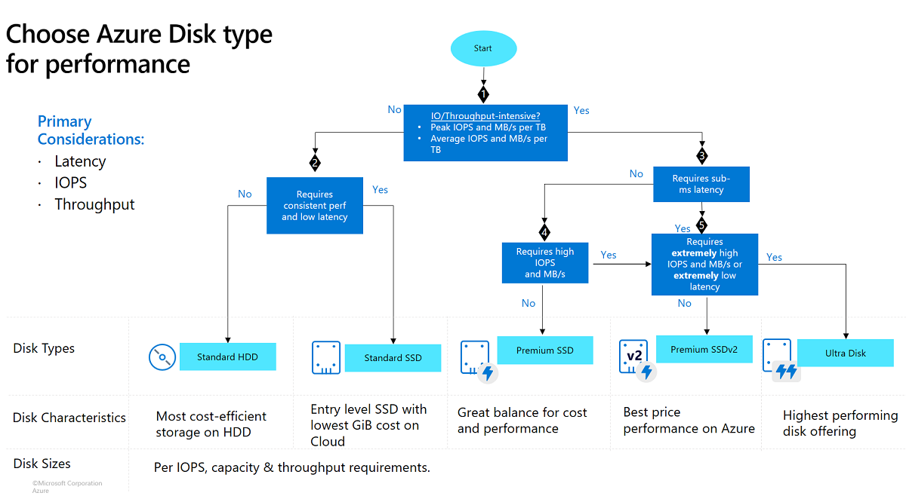

## 1. Planning for Azure VM Deployment

### What is an Azure VM?
An **Azure Virtual Machine (VM)** is an **on-demand, scalable compute resource** — essentially a full server (OS + apps) running inside Azure's infrastructure. It's Azure's core **Infrastructure-as-a-Service (IaaS)** offering.

### Planning Checklist (Before You Deploy)
Good VM planning answers these questions **before** clicking "Create":

| Question | Why it matters |
|---|---|
| **What workload will run on it?** | Determines OS, VM size/series, and disk type |
| **Which region?** | Affects latency, compliance/data residency, pricing, and available VM sizes |
| **Do I need high availability?** | Determines if you need Availability Zones / Availability Sets |
| **What's my budget?** | Determines VM series, disk tier, and pricing model (Pay-As-You-Go vs Reserved vs Spot) |
| **Networking requirements?** | Determines VNet, subnet, NSG, and public IP needs |
| **Security & identity needs?** | Determines managed identity, RBAC, disk encryption |
| **How will I manage it long-term?** | Determines backup, monitoring, and patching strategy |

### The 4 Pillars of VM Planning
1. **Compute** → OS + VM size/series
2. **Storage** → Managed disk type(s)
3. **Networking** → Region, VNet, NSG, Public IP
4. **Resiliency** → Availability Zones/Sets, backup strategy

📘 **Official Docs:** [Azure Virtual Machines documentation](https://learn.microsoft.com/en-us/azure/virtual-machines/)

---

## 2. Selecting OS, VM Size, and Disk Types

### A) Operating System
Azure supports both:
- **Windows Server** (various versions) — licensing included in VM cost
- **Linux** (Ubuntu, Red Hat, SUSE, Debian, etc.) — many free/open-source images, some paid (e.g., RHEL)

**Choosing factors:** application compatibility, team's OS skillset, licensing cost, and available VM extensions/tools for that OS.

### B) VM Size (Series)
VM size = how much **CPU, RAM, temp storage, and network bandwidth** the VM gets. Sizes are grouped into **series/families** (covered in depth in Section 5).

**Quick decision guide:**
| Workload | Recommended Family |
|---|---|
| Dev/test, small apps | General Purpose (B, A, D-series) |
| Databases, in-memory caching | Memory Optimized (E-series) |
| Batch processing, analytics, gaming servers | Compute Optimized (F-series) |
| Big data, storage-heavy workloads | Storage Optimized (L-series) |
| AI/ML, rendering, visualization | GPU (N-series) |

### C) Disk Type
Every VM needs at least an **OS disk**, and often one or more **data disks**. Disk type controls performance (IOPS/throughput) and cost — covered in depth in Section 6.



### Putting It Together — A Simple Selection Flow
```
1. Pick OS based on app compatibility
        │
        ▼
2. Estimate CPU/RAM needs → pick VM family → pick specific size
        │
        ▼
3. Estimate I/O needs (database? web server? batch job?) → pick disk type
        │
        ▼
4. Validate: does the chosen region support this VM size + disk combo?
```

📘 **Official Docs:**
- [Sizes for virtual machines in Azure](https://learn.microsoft.com/en-us/azure/virtual-machines/sizes/overview)
- [Select a disk type for Azure VMs](https://learn.microsoft.com/en-us/azure/virtual-machines/disks-types)

---

## 3. Understanding Regions and Availability Zones

### Azure Regions
A **region** is a set of datacenters connected by a low-latency network, deployed within a general geographic area. <cite index="81-1">An Azure region consists of one or more datacenters, connected by a high-capacity, fault-tolerant, low-latency network connection, typically located within a large metropolitan area.</cite>

- Every resource you deploy is tied to a region (e.g., East US, West Europe, Southeast Asia)
- Not every service/VM size is available in every region — always check availability first

### Availability Zones (AZs)
<cite index="81-1">Availability zones are independent sets of datacenters within a region that have isolated power, cooling, and network connections, physically located close enough to provide low-latency networking but far enough apart for fault isolation from local disasters like storms or power outages.</cite>

- Most regions with AZ support offer **at least 3 zones**
- Deploying VMs across zones protects against a **datacenter-level failure**, not just a single server/rack failure

### Resiliency Options Compared

| Option | Protects Against | Scope |
|---|---|---|
| **Availability Set** | Hardware failure (single rack/switch/power source) within one datacenter | Same datacenter |
| **Availability Zone** | Entire datacenter failure (power, cooling, network outage) | Same region, different physical datacenters |
| **Region Pair** | Entire region failure (large-scale disaster) | Different, geographically separated regions |

### Why This Matters for VM Planning
- **Mission-critical workloads** → deploy across Availability Zones **and** consider multi-region for disaster recovery
- **Simple dev/test VM** → a single zone/region is usually fine
- Choosing a region also affects **latency to your users**, **data residency/compliance**, and **pricing** (prices vary by region)

📘 **Official Docs:**
- [What are Azure regions? – Microsoft Learn](https://learn.microsoft.com/en-us/azure/reliability/regions-overview)
- [What are Azure Availability Zones? – Microsoft Learn](https://learn.microsoft.com/en-us/azure/reliability/availability-zones-overview)


## 4. Pricing and Cost Estimations

### What Drives VM Cost?
| Factor | Impact |
|---|---|
| **VM size/series** | More vCPU/RAM = higher hourly cost |
| **Region** | Prices vary — some regions are cheaper than others |
| **OS** | Windows VMs typically cost more (licensing) than Linux |
| **Disk type & size** | Premium/Ultra disks cost more than Standard HDD |
| **Uptime** | You're billed for compute while the VM is *running* (stopped-deallocated VMs don't incur compute charges, but disks still do) |
| **Pricing model** | Pay-As-You-Go vs Reserved Instances vs Spot VMs vs Savings Plan |

### Pricing Models
| Model | Best For | Trade-off |
|---|---|---|
| **Pay-As-You-Go** | Unpredictable/short-term workloads | Highest hourly rate, full flexibility |
| **Reserved Instances (1 or 3 yr)** | Steady, predictable long-term workloads | Big discount, but committed spend |
| **Azure Savings Plan** | Flexible steady usage across VM types | Discount with less rigidity than Reserved |
| **Spot VMs** | Interruptible/batch workloads (can be evicted) | Cheapest option, but Azure can reclaim the VM anytime |
| **Azure Hybrid Benefit** | Orgs with existing Windows Server/SQL licenses | Reuse on-prem licenses to cut Azure cost |

### Estimating Costs Before Deployment
- **Azure Pricing Calculator** — <cite index="94-1">estimates costs based on region, size, operating system, tier, and other specific features, pulling per-unit pricing from the Azure Retail Prices API</cite>
- **Azure Migrate / TCO tooling** — for comparing on-premises infrastructure costs against equivalent Azure costs when planning a migration
- **Cost Management + Billing (in-portal)** — track actual spend after deployment, set budgets and alerts

📘 **Official Docs:**
- [Azure Pricing Calculator](https://azure.microsoft.com/en-us/pricing/calculator/)
- [Estimate costs with the Azure pricing calculator – Microsoft Learn](https://learn.microsoft.com/en-us/azure/cost-management-billing/costs/pricing-calculator)

--- 

## 5. Azure VM Series/Types (Instance Types)

### The Naming Convention
Azure VM names follow a pattern like `Standard_D4s_v5`:
- **D** = Family/series (workload type)
- **4** = Number of vCPUs
- **s** = Premium storage capable
- **v5** = Version generation

### Main VM Families

| Family | Optimized For | Typical Use Cases |
|---|---|---|
| **A-series** | Entry-level, general purpose | Dev/test, small databases, low-traffic web servers |
| **B-series** | Burstable general purpose (CPU credits) | Small workloads with occasional spikes (e.g., dev boxes) |
| **D-series** | Balanced general purpose | Enterprise apps, web/app servers, moderate-traffic production |
| **E-series** | Memory optimized | In-memory databases (SQL, SAP HANA), analytics, caching |
| **F-series** | Compute optimized (high CPU-to-memory ratio) | Batch processing, network appliances, medium-traffic web servers |
| **L-series** | Storage optimized (high disk throughput/IOPS) | Big data, NoSQL databases (Cassandra, MongoDB) |
| **N-series** | GPU-accelerated | AI/ML training, visualization, rendering, gaming |
| **H-series (HPC)** | High Performance Computing | Simulations, computational fluid dynamics, financial risk modeling |

### How B-series Bursting Works (Good Teaching Example)
<cite index="67-1">B-series VMs are the only Azure VM type that uses a CPU credit model: the VM accumulates credits while running below its baseline CPU performance, and spends those credits to "burst" above baseline when needed, until credits run out — then it's throttled back to baseline until credits rebuild.</cite> This makes B-series great (and cheap) for workloads that are mostly idle with occasional spikes.

### Choosing a Series — Quick Rule of Thumb
- **"I don't know yet, just testing"** → B-series or D-series
- **"Lots of RAM needed (database)"** → E-series
- **"Lots of CPU needed (processing)"** → F-series
- **"Need a GPU"** → N-series
- **"Massive local disk I/O"** → L-series

📘 **Official Docs:** [Virtual machine sizes overview – Microsoft Learn](https://learn.microsoft.com/en-us/azure/virtual-machines/sizes/overview)

---

## 6. Azure Managed Disk Types

### What Are Managed Disks?
<cite index="73-1">Azure managed disks are block-level storage volumes managed by Azure and used with Azure Virtual Machines — virtualized versions of physical disks in an on-premises server. You only specify the disk type and size, then Azure handles provisioning and the rest.</cite>

### The 5 Disk Types

| Disk Type | Performance | Best For |
|---|---|---|
| **Standard HDD** | Lowest cost, higher latency | Backup, infrequently accessed/archival data, dev/test |
| **Standard SSD** | <cite index="76-1">Designed to deliver write latencies under 10 ms and read latencies under 20 ms for most operations</cite> | Web servers, lightly used apps, dev/test environments |
| **Premium SSD** | High IOPS, low latency, consistent performance | Production workloads, databases, performance-sensitive apps |
| **Premium SSD v2** | Independently configurable size/IOPS/throughput | Production workloads needing fine-tuned performance at lower cost than Ultra |
| **Ultra Disk** | <cite index="77-1">Azure's highest-performing storage option, allowing performance parameters to be changed without restarting the VM</cite> | <cite index="77-1">Data-intensive, transaction-heavy workloads such as SAP HANA and top-tier databases</cite> |

### Important Rules to Teach
- <cite index="77-1">Ultra Disks must be used as data disks only (not OS disks) and can only be created as empty disks — when using them, pair with a Premium SSD as the OS disk.</cite>
- OS disk vs Data disk: the **OS disk** holds the operating system; **data disks** hold your application data — you can attach multiple data disks to one VM
- <cite index="72-1">You can easily switch between Premium SSD, Standard SSD, and Standard HDD based on performance needs, and Premium SSD and Standard SSD are also available with zone-redundant storage — but disk type conversion requires a VM restart.</cite>

### Simple Decision Guide
```
Is it mission-critical / needs ultra-low latency (e.g., SAP HANA)?
        → Ultra Disk (data) + Premium SSD (OS)

Is it a standard production workload (business app, SQL DB)?
        → Premium SSD or Premium SSD v2

Is it a web server / dev-test / light workload?
        → Standard SSD

Is it backup / rarely accessed / cost is #1 priority?
        → Standard HDD
```

📘 **Official Docs:**
- [Overview of Azure Disk Storage – Microsoft Learn](https://learn.microsoft.com/en-us/azure/virtual-machines/managed-disks-overview)
- [Select a disk type for Azure VMs – Microsoft Learn](https://learn.microsoft.com/en-us/azure/virtual-machines/disks-types)

--- 

## Quick Recap Table

| Concept | One-Line Summary |
|---|---|
| **VM Planning** | Decide OS, size, disk, region, and resiliency needs *before* deploying |
| **OS/Size/Disk Selection** | Match the workload's CPU/RAM/I-O profile to the right combination |
| **Regions & Availability Zones** | Regions = geographic location; AZs = physically separate datacenters within a region for fault isolation |
| **Pricing** | Cost driven by size, region, OS, disk, and pricing model (PAYG/Reserved/Spot/Hybrid Benefit) — estimate with the Pricing Calculator |
| **VM Series** | Each family (A/B/D/E/F/L/N/H) is optimized for a different workload profile |
| **Managed Disks** | 5 tiers (HDD → Standard SSD → Premium SSD → Premium SSD v2 → Ultra) trading cost for performance |
