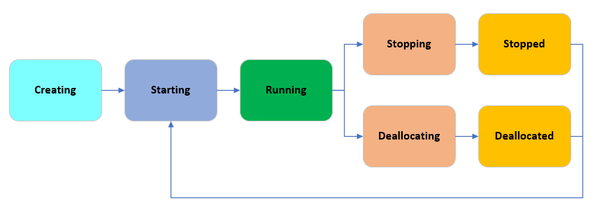
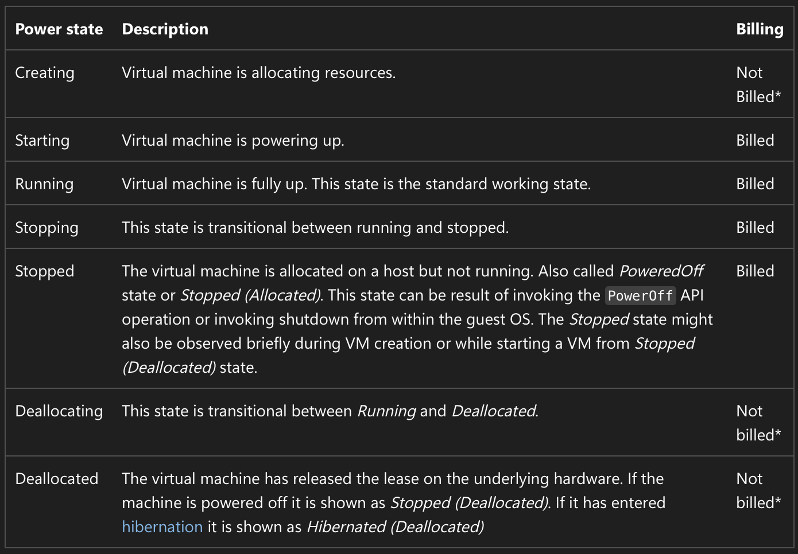

# Day 5 — Azure Administration
### Topics: Deploying VMs (Portal/PowerShell/CLI) | Availability Sets & Scale Sets | VM Extensions | VM Lifecycle | Azure Bastion & Azure Firewall

---

## 1. Deploying VMs from Portal, PowerShell, and CLI

### Same Destination, Three Routes
Just like ARM template deployments (Day 2-3), creating a VM can be done through any of the three tools — all hitting the same ARM API underneath.

### A) Portal
1. Search **"Virtual machines"** → **+ Create**
2. Fill in **Basics** (Resource Group, VM name, Region, Image, Size, Auth type, Admin credentials)
3. Configure **Disks**, **Networking**, **Management**, **Monitoring** tabs as needed
4. **Review + Create**

Best for: first-time learners, visualizing every option, one-off VMs.

### B) Azure CLI
```bash
az group create --name rg-vm-day5 --location eastus

az vm create \
  --resource-group rg-vm-day5 \
  --name vm-cli-demo \
  --image Ubuntu2404 \
  --size Standard_B2s \
  --admin-username azureuser \
  --generate-ssh-keys
```

### C) Azure PowerShell
```powershell
New-AzResourceGroup -Name "rg-vm-day5" -Location "EastUS"

$cred = Get-Credential
New-AzVM `
  -ResourceGroupName "rg-vm-day5" `
  -Name "vm-ps-demo" `
  -Location "EastUS" `
  -Image "Win2022Datacenter" `
  -Size "Standard_B2s" `
  -Credential $cred
```

## 2. VM Availability Sets and Scale Sets

### Availability Sets — Protecting Against Hardware Failure
An **Availability Set** is a logical grouping that spreads VMs across isolated hardware within **one datacenter**, so a single hardware failure doesn't take down your whole application.

### Scale Sets — Scaling AND High Availability
<cite index="99-1">Azure Virtual Machine Scale Sets let you create and manage a group of load-balanced VM instances, where the number of instances can automatically increase or decrease in response to demand or a defined schedule.</cite>


📘 **Official Docs:**
- [Availability sets overview – Microsoft Learn](https://learn.microsoft.com/en-us/azure/virtual-machines/availability-set-overview)
- [Azure Virtual Machine Scale Sets overview – Microsoft Learn](https://learn.microsoft.com/en-us/azure/virtual-machine-scale-sets/overview)

---
## Azure VM Extensions
Think of an Azure VM Extension as a small plugin/agent that you install on an Azure Virtual Machine to perform an additional task.

## Common examples
- Custom Script Extension → Run PowerShell/Bash scripts
- Azure Monitor Agent → Collect monitoring data
- Antimalware Extension → Configure malware protection

---
## VM lifecycle 


##  Azure Bastion (for Secure Proxy Access) and Azure Firewall

### Azure Bastion
<cite index="126-1">Azure Bastion is a fully managed PaaS service that provides secure and seamless RDP/SSH connectivity to virtual machines directly over TLS from the Azure portal, or via the native SSH or RDP client already installed on your local computer.</cite>

**Why it matters:**
- <cite index="126-1">Your VMs don't need a public IP address, agent, or special client software when connecting via Bastion</cite>
- <cite index="126-1">Protects VMs from external threats like port scanning</cite> — no RDP (3389) or SSH (22) port ever exposed to the internet
- <cite index="126-1">Connects over TLS on port 443</cite> — works even through strict corporate firewalls
- <cite index="126-1">Deploy with availability zones for additional resilience</cite>

**Key setup fact:** Bastion is deployed into a **dedicated subnet** in your VNet that **must be named `AzureBastionSubnet`**.

**SKUs:** Basic, Standard, Premium (Premium adds session recording for compliance), plus a free **Developer** tier for connecting to one VM at a time.

📘 **Official Docs:** [What is Azure Bastion? – Microsoft Learn](https://learn.microsoft.com/en-us/azure/bastion/bastion-overview)


